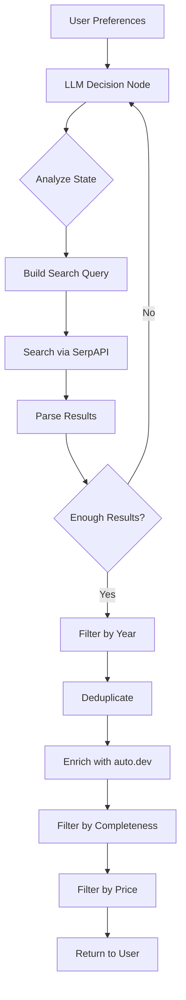

# AutoMatch - AI-Driven Car Shopping

## 🎯 What We Built

A car shopping webapp with an **agentic AI backend** that intelligently searches for cars based on user preferences. The AI agent makes strategic decisions about how to search, adapting its strategy based on results.

## ✨ Key Features

### 1. **True Agentic AI** 🤖
The LLM is not just a fancy function - it's the **primary driver** of the search:
- **Analyzes** the current search state
- **Reasons** about next steps
- **Decides** search strategies dynamically
- **Adapts** based on results

### 2. **Data Quality Filtering** ✅
Only shows cars with sufficient data:
- Must have make, model, year
- Must have 75% of: price, photos, specs, VIN/location
- Filters out incomplete listings automatically

### 3. **Transparent AI** 🔍
Users can see what the AI is thinking:
- LLM reasoning displayed in UI
- Search strategy explanation
- Number of attempts shown

## 🚀 Quick Start

### Backend
```bash
cd backend
python -m venv venv
source venv/bin/activate  # On Windows: venv\Scripts\activate
pip install -r requirements.txt
python run.py
```

### Frontend
```bash
cd frontend
npm install
npm run dev
```

## 📁 Project Structure

### Backend (`/backend`)
```
app/
├── agents/
│   ├── search_agent.py      # 🧠 Main agentic workflow (LangGraph)
│   └── price_agent.py        # Price analysis
├── routes/
│   ├── search.py             # Search endpoint + data filtering
│   └── swipe.py              # User interaction tracking
├── services/
│   └── auto_dev.py           # Car data enrichment
├── models/
│   └── preferences.py        # User preference tracking
├── llm_client.py             # LLM integration
└── config.py                 # Configuration
```

### Frontend (`/src`)
```
pages/
├── Index.tsx                 # Landing page
├── FinancePreferences.tsx    # Budget & financing
├── PhysicalPreferences.tsx   # Body type, features
├── Swipe.tsx                 # 💫 Car swiping interface
└── Liked.tsx                 # Saved cars

components/ui/                # shadcn/ui components
```

## 🧠 How the Agent Works

### Traditional Pipeline (Before)
```
User Input → Build Query → Search → Filter → Return
```
❌ **Problem**: LLM just follows orders, no real intelligence

### Agentic Workflow (After)
```
User Input → [LLM Decision Loop] → Return
              ↓
         1. Analyze state
         2. Reason about strategy  
         3. Decide next action
         4. Search
         5. Evaluate results
         6. Loop or end
```
✅ **Solution**: LLM makes strategic decisions at each step

### Example Agent Reasoning

**Attempt 1** (No results):
```
🤖 Reasoning: "No luxury sedans found at $80k. Will broaden to premium brands and include SUVs."
🔍 Next Query: "BMW Mercedes Audi luxury sedan SUV 2021-2024 $70000-$90000"
```

**Attempt 2** (1 result):
```
🤖 Reasoning: "Found BMW 5 Series. Should search for direct competitors to give user options."
🔍 Next Query: "Mercedes E-Class Audi A6 Lexus ES Genesis G80 luxury sedan 2021-2024"
```

**Attempt 3** (4 results):
```
🤖 Reasoning: "Have good luxury options. Now finding value alternatives with similar features."
🔍 Next Query: "Genesis G70 Volvo S60 Cadillac CT5 luxury features 2021-2024 under $70000"
📋 Decision: "end" (5 quality results found)
```

## 🎨 User Experience Flow

1. **Set Preferences**
   - Budget & financing
   - Body types (sedan, SUV, etc.)
   - Features (AWD, sunroof, etc.)
   - Colors

2. **AI Search** 🤖
   - Agent runs adaptive search
   - Finds 5+ quality cars
   - Filters by completeness & price
   - Shows reasoning in UI

3. **Swipe Interface** 👆
   - Tinder-style car cards
   - Swipe right = like
   - Swipe left = pass
   - View details dialog

4. **Liked Cars** ❤️
   - Review favorites
   - Compare options
   - Make decision

## 🔧 Configuration

### Environment Variables (`.env`)
```bash
# Required
OPENAI_API_KEY=sk-...
SERPAPI_KEY=...
AUTO_DEV_API_KEY=...

# Optional
FLASK_ENV=development
PORT=5001
```

### Key Settings
- **Max search attempts**: 5
- **Target results**: 5 cars
- **Completeness threshold**: 75%
- **Price range**: 60%-110% of budget
- **Year range**: Budget-dependent (e.g., $100k → 2021+)

## 📊 Data Quality Metrics

### Completeness Filter
A car must have:
- ✅ Make, model, year (critical)
- ✅ 3 out of 4:
  - Price (market value)
  - Photos (at least 1)
  - Specs (at least 2)
  - VIN or location

### Example: Complete Car ✅
```json
{
  "make": "BMW",
  "model": "5 Series",
  "year": 2023,
  "price": { "marketValue": 65000 },
  "photos": ["url1", "url2", "url3"],
  "specs": {
    "mpg": "23/31",
    "horsepower": 335,
    "transmission": "Automatic"
  },
  "vin": "WBA5R1C04JB253456"
}
```
✅ Completeness: 4/4 (100%)

### Example: Incomplete Car ❌
```json
{
  "make": "BMW",
  "model": "5 Series",
  "year": 2023,
  "price": null,
  "photos": [],
  "specs": {},
  "vin": null
}
```
❌ Completeness: 0/4 (0%) - **Filtered out**

## 🧪 Testing the Agent

### See the LLM in Action
1. Start backend with logging
2. Make a search request
3. Watch console for:
   ```
   🤖 LLM Reasoning: ...
   🔍 Next Query: ...
   📋 Decision: search/end
   ```

### Test Edge Cases
- **High budget** ($100k+): Should target luxury brands, recent years
- **Low budget** ($15k): Should target reliable brands, older years
- **Specific features**: Should incorporate into search
- **No results**: Should broaden intelligently

## 📝 API Endpoints

### POST `/api/search/suggestions`
Search for cars based on preferences
```json
{
  "budget": 50000,
  "bodyTypes": ["sedan", "SUV"],
  "features": ["AWD", "sunroof"],
  "colors": ["black", "white"]
}
```

**Response:**
```json
{
  "suggestions": [...],
  "llm_reasoning": "Found luxury sedans, searching for SUV alternatives...",
  "attempts": 2,
  "search_strategy": "LLM-driven adaptive search"
}
```

### POST `/api/swipe`
Record user swipe interaction
```json
{
  "car": { "make": "BMW", "model": "5 Series", ... },
  "liked": true
}
```

## 🚦 Workflow Visualization



## 🎯 Future Improvements

1. **Multi-step reasoning**: Chain-of-thought for complex searches
2. **User feedback loop**: Learn from swipes to improve future searches
3. **Caching**: Store LLM decisions for similar searches
4. **A/B testing**: Compare LLM vs rule-based strategies
5. **Streaming**: Show LLM thinking in real-time
6. **Multiple data sources**: Integrate more listing APIs

## 📚 Tech Stack

### Backend
- **Flask**: Web framework
- **LangGraph**: Agent workflow orchestration
- **OpenAI GPT-4**: LLM for decision making
- **SerpAPI**: Web search for car listings
- **auto.dev**: Car data enrichment
- **Pydantic**: Data validation

### Frontend
- **React**: UI framework
- **TypeScript**: Type safety
- **Tailwind CSS**: Styling
- **shadcn/ui**: UI components
- **React Router**: Navigation
- **Sonner**: Toast notifications

## 🤝 Contributing

The agent is designed to be extensible. Key extension points:

1. **New data sources**: Add to `services/`
2. **New filters**: Modify `routes/search.py`
3. **New agent nodes**: Add to `agents/search_agent.py`
4. **New LLM prompts**: Update `llm_decision_node()`

## 📄 License

MIT

---

**Built with ❤️ using agentic AI principles**
